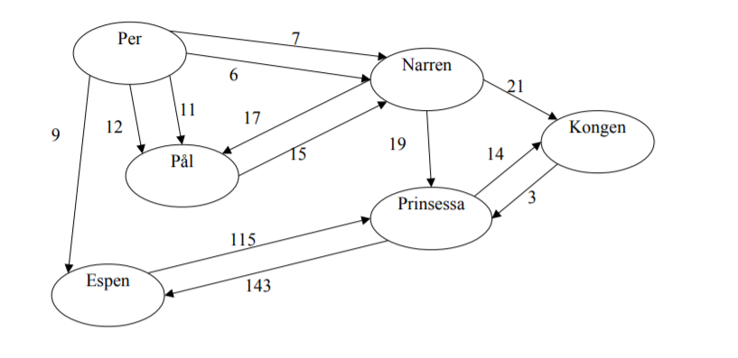

# Gammel-eksamensoppgave
Gammel eksamensoppgave til IS-207 (Nå IS-211), fra 2011  
Oppgaven ligger nedenfor  

# E K S A M E N

```
Emnekode: IS-207
Emnenavn: Algoritmer og datastrukturer
```
```
Dato: 23. mai 2011
Varighet: 0900-1300
```
```
Antall sider inkl. forside: 4
```
```
Målform: Norsk
```
```
Tillatte hjelpemidler: Alle trykte og skrevne
```
```
Merknader:
```
___________________________________________________________________________



## Innledning

Stortinget har bestemt at EUs datalagringsdirektiv skal innføres i Norge. I denne oppaven skal
vi se på hvordan man kan analysere data som skal lagres i følge direktivet. Vi kan for
enkelhets skyld anta at vi har en logg over alle telefonsamtaler i et bestemt tidsrom. Hvis vi
teller opp hvor mange ganger en person har ringt en annen, kan vi bygge opp en graf som vist
i figuren under.

Vi kan se av grafen at Per, Pål og Narren har hatt relativt hyppig kontakt. Det samme har
Espen og Prinsessa. Per har f.eks. ringt Pål 11 ganger, og narren 7 ganger.

Overvåkningspolitiet, hvis de mistenker Per for å ville kidnappe Prinsessa og tilrane seg halve
kongeriket, kan bruke grafen til å finne de medskyldige. Skandalepressen vil derimot være
mer interessert i om det er noe mellom Espen og Prinsessa (hvis de får tak i grafen).

## Oppgave 1

Vi skal bruke klassen KontaktNett til å analysere grafen (se vedlegg 1). Et KontaktNett objekt
inneholder grafen og metoder for å analysere den. Vi starter med registreringen av data.

```
a) Skriv feltdeklarasjonene du trenger for å holde på grafen, og eventuelle hjelpeklasser.
Begrunn valgene du har gjort.
b) Skriv konstruktøren for KontaktNett
c) Skriv ferdig metoden registrerSamtale(). Metoden registrer en ny samtale fra en
person til en annen.
Hvis Kongen ringer Prinsessa må antallet på den eksisterende kanten økes til 4. Hvis
Kongen ringer Narren må det legges til en ny kant med antall 1.
```

## Oppgave 2

I denne delen av oppgaven skal vi se på analysen av dataene. Vi antar at politiet prøver å
avdekke sammensvergelser ved å finne personer som har hatt tett kontakt. Tett kontakt kan
f.eks. bety at noen har ringt hverandre mer enn ant ganger. Hvis vi velger ant = 10, vil Per og
Pål, Pål og Narren, og Espen og Prinsessa ha hatt tett kontakt. Kongen og Prinsessa har ikke
hatt tett kontakt (selv om Prinsessa har ringt Kongen mer enn 10 ganger har Kongen bare
ringt Prinsessa noen få ganger).
Hvis vi i stedet velger ant=5, vil også Per og Narren ha tett kontakt.

```
a) Skriv ferdig metoden finnDirekteKontakter(). Metoden skal returnere en liste av
personer som en mistenkt har hatt direkte tett kontakt med. F.eks. skal
finnDirekteKontakter(Pål, 10) returnere en liste som inneholder Per og Narren, og
finnDirekteKontakter(Per, 10) returnere en liste som inneholder Pål.
b) Skriv ferdig metoden finnAlleKontakter. Metoden skal returnere en liste av personer
som en mistenkt har hatt direkte eller indirekte tett kontakt med. F.eks. skal
finnAlleKontakter(Per, 10) returnere en liste som inneholder Pål og Narren, fordi Per
og Pål har ringt hverandre mer enn 10 ganger. Det samme har Pål og Narren, så Per og
Narren kan ha kommunisert via Pål.
```

## Vedlegg 1: Class KontaktNett
```
public class KontaktNett {

// Oppgave 1a - feltdeklarasjonerr

public KontaktNett() {
// Oppgave 1b - constructor
}

/**
* Registrer en samtale i grafen
* @param fra - navnet på personen som ringte
* @param til - navnet på personen han ringte til
*/
public void registrerSamtale(String fra, String til) {
// oppgave 1c
}

/**
* Returner en liste over personer som en mistenkt har hatt tett
* kontakt med.
* @param mistenkt - navnet på den mistenkte personen
* @param ant - antall ganger to personer må ringt hverandre
* for å ha hatt tett kontakt
*/
public List<String> finnDirekteKontakter(String mistenkt, int ant) {
// oppgave 2a
}

/**
* Returner en liste over personer som en mistenkt har hatt
* direkte eller indirekte tett kontakt med.
* @param mistenkt - navnet på den mistenkte personen
* @param ant - antall ganger to personer må ringt hverandre
* for å ha hatt tett kontakt
*/
public List<String> finnAlleKontakter(String mistenkt, int ant) {
// oppgave 2b
}
}
```
